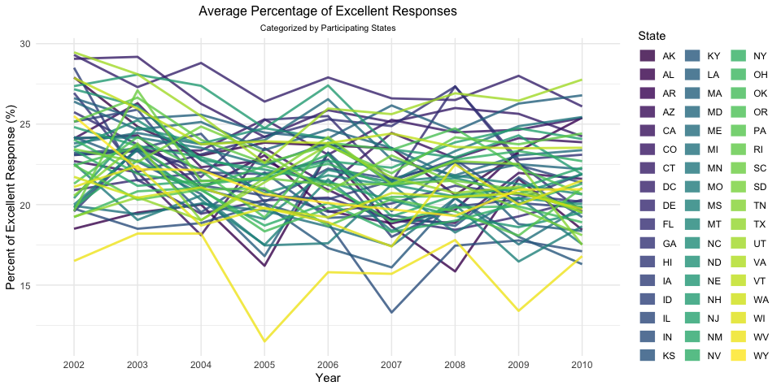

P8105 Data Science I - Homework 3
================
Kevin S.W.
10/3/2019

# Introduction

Homework for showing capability in data visualization and exploratory
data analysis

# Problem 1 - InstaCart Data Wrangling and Visualization

``` r
# Loads instacart data from source
library(p8105.datasets)
data("instacart")

# Assigns a new dataframe to the data-source to prevent frequent "reloads"
### Not sure if necessary.
insta_df <- instacart %>%  
  janitor::clean_names() %>% 
  mutate(
    aisle = as.factor(str_to_title(aisle)),
    aisle_id = as.factor(aisle_id),
    department = as.factor(str_to_title(department))
  )
```

The InstaCart dataset collects data on customers and the things they
order from local groceries. Data that we’re using are cleaned previously
and is limited because it only contains data from `eval_set = train`;
likely dataset used in model-building. The dataframe contains 1384617
observations from 15 categories including `eval_set`. All these
variables are linked in some way. For example, these variables are
likely of particular importance:

  - `order_id`: order identifier; if a person starts an order, all the
    items inside will have the same `order_id`
  - `product_id`: product identifier which links a value to certain
    products (e.g. 340 = cake, 255 = soda, etc)
  - `user_id`: customer identifier; unique id for customers (Peanut’s id
    = 1000, John’s id = 13,…)
  - `order_dow`: the day of the week on which the order was placed (Mon,
    Tues, Wed,…)
  - `order_hour_of_day`: the hour of the day on which the order was
    placed (13:00, 21:00,…)
  - `product_name`: name of product such as “Organic Garlic”, “Spring
    Water”, or “Xpolsive Pizza Baked Snack Cracker”
  - `aisle_id`: aisle identifier that is linked to `aisle` as a unique
    identifier
  - `department_id`: department identifier
  - `aisle`: the name of the aisle such as fresh vegetables or yogurt
  - `department`: the name of the department (canned goods, snacks,
    frozen,
…)

### Problem 1a - Data Cleaning/Tidying to Evaluate \# of Items Ordered per Aisle

This dataset is huge as indicated previously. As such, we have to filter
out some things in the interest of efficiency.

``` r
aisle_summary <- insta_df %>% 
  select(product_name, aisle_id, aisle) %>% 
  drop_na() %>% 
  group_by(aisle, aisle_id) %>% 
  summarize(
    aisle_order_count = n()
  ) %>% 
  arrange(desc(aisle_order_count))
```

After cleaning and filtering to only contain relevant columns for our
aisle vs \# of orders analysis, it shows that the filtered data contains
134 unique aisles and Fresh Vegetables is/are the most ordered item with
150609 orders.

We then make a graph below to illustrate the relationship between
numbers of item ordered and its associated aisle.

``` r
aisle_summary %>% 
  filter(aisle_order_count > 10000) %>% 
  ggplot(aes(x = reorder(aisle, aisle_order_count), 
             y = aisle_order_count , 
             fill = -aisle_order_count)) +
  geom_bar(stat = "identity") +
  labs(title = "# of Items Ordered for Each Aisle",
       subtitle = "for Items with > 10,000 orders",
       x = "Aisle of items (from most to least)",
       y = "# of items ordered") +
  theme(plot.title = element_text(hjust = 0.5, size = 12),
        plot.subtitle = element_text(hjust = 0.5, size = 8),
        legend.position = "none",
        axis.text.y = element_text(angle = 10, hjust = 1, vjust = 1, size = 8),
        panel.grid.major.y = element_blank()) +
  coord_flip()
```


The graph shows the number of items ordered that are greater than 10,000
under the aisle category (e.g. butter is ordered 10575 times). Arranged
from most to least, we can see a huge gap between the top ~5 versus the
rest. In the graph, there are a total of 39 items.

### Problem 1b - Making Table for Top 3 Items in Particular Aisles.

First, we have to isolate our relevant columns and filter based on our
needs.

``` r
insta_df %>% 
  select(product_name, aisle) %>% 
  drop_na() %>% 
  group_by(aisle, product_name) %>% 
  summarize(product_count = n()) %>% 
  top_n(3, wt = product_count) %>% 
  filter(aisle %in% c("Baking Ingredients", "Dog Food Care", "Packaged Vegetables Fruits")) %>% 
  arrange(aisle, desc(product_count)) %>% 
  knitr::kable()
```

| aisle                      | product\_name                                 | product\_count |
| :------------------------- | :-------------------------------------------- | -------------: |
| Baking Ingredients         | Light Brown Sugar                             |            499 |
| Baking Ingredients         | Pure Baking Soda                              |            387 |
| Baking Ingredients         | Cane Sugar                                    |            336 |
| Dog Food Care              | Snack Sticks Chicken & Rice Recipe Dog Treats |             30 |
| Dog Food Care              | Organix Chicken & Brown Rice Recipe           |             28 |
| Dog Food Care              | Small Dog Biscuits                            |             26 |
| Packaged Vegetables Fruits | Organic Baby Spinach                          |           9784 |
| Packaged Vegetables Fruits | Organic Raspberries                           |           5546 |
| Packaged Vegetables Fruits | Organic Blueberries                           |           4966 |

### Problem 1c - Table for Mean Hour of Day at which Products are ordered.

  - Make a table showing the mean hour of the day at which Pink Lady
    Apples and Coffee Ice Cream are ordered on each day of the week;
    format this table for human readers (i.e. produce a 2 x 7 table).

<!-- end list -->

``` r
insta_df %>% 
  select(order_dow, order_hour_of_day, product_name) %>% 
  drop_na() %>% 
  group_by(product_name, order_dow) %>% 
  summarize(mean_hour = mean(order_hour_of_day)) %>% 
  filter(product_name %in% c("Pink Lady Apples", "Coffee Ice Cream")) %>% 
  mutate(
    order_dow = lubridate::wday(order_dow + 1, label = T)) %>% 
  pivot_wider(names_from = order_dow,
              values_from = mean_hour) %>% 
  knitr::kable(digits = 2)
```

| product\_name    |   Sun |   Mon |   Tue |   Wed |   Thu |   Fri |   Sat |
| :--------------- | ----: | ----: | ----: | ----: | ----: | ----: | ----: |
| Coffee Ice Cream | 13.77 | 14.32 | 15.38 | 15.32 | 15.22 | 12.26 | 13.83 |
| Pink Lady Apples | 13.44 | 11.36 | 11.70 | 14.25 | 11.55 | 12.78 | 11.94 |

# Problem 2

For this problem, we will be loading the BRFSS data included in the
p8105 package. As the data is huge and there were places where it’s not
tidy, we should tidy this up first by first focusing on pertinent
information (i.e. topic = “Overall Health and only”Excellent" - “Poor”
responses).

``` r
# Loads BRFSS data from source
data("brfss_smart2010")

# Assigns a new dataframe to the data-source to prevent frequent "reloads"
### Not sure if necessary.
brfss_df <- brfss_smart2010 %>%  
  janitor::clean_names() %>% 
  rename(
    state = locationabbr,
    county = locationdesc
  ) %>% 
  filter(topic == "Overall Health",
         response %in% c("Excellent", "Very good", "Good", "Fair", "Poor")) %>% 
  mutate(
    response = factor(response, levels = c("Poor", "Fair", "Good", "Very Good", "Excellent"))
  )
```

``` r
brfss_locations <- brfss_df %>% 
  group_by(year, state) %>% 
  select(year, state, county) %>% 
  filter(year %in% c("2010", "2002")) %>% 
  summarize(county_per_state = n())

# 2002 locations
state_2002 <- brfss_locations %>% 
  filter(year == "2002",
         county_per_state > 6) %>%
  pivot_wider(names_from = state,
              values_from = county_per_state
  ) %>% 
  ungroup() %>% 
  select(-year)

  knitr::kable(list(t1 = head(state_2002)[1:18],
                    t2 = head(state_2002)[19:36]
                    )
               )
```

| AZ | CO | CT | DE | FL | GA | HI | ID | IL | IN | KS | LA | MA | MD | ME | MI | MN | MO |
| -: | -: | -: | -: | -: | -: | -: | -: | -: | -: | -: | -: | -: | -: | -: | -: | -: | -: |
| 10 | 20 | 35 | 15 | 35 | 15 | 20 | 10 | 15 | 10 | 15 | 15 | 40 | 30 | 10 | 20 | 20 | 10 |

| NC | NE | NH | NJ | NV | NY | OH | OK | OR | PA | RI | SC | SD | TN | TX | UT | VT | WA |
| -: | -: | -: | -: | -: | -: | -: | -: | -: | -: | -: | -: | -: | -: | -: | -: | -: | -: |
| 35 | 15 | 25 | 40 | 10 | 25 | 20 | 15 | 15 | 50 | 20 | 15 | 10 | 10 | 10 | 25 | 15 | 20 |

``` r
# 2010 locations
state_2010 <- brfss_locations %>% 
  filter(year == "2010",
         county_per_state > 6) %>%
  pivot_wider(names_from = state,
              values_from = county_per_state
  ) %>% 
  ungroup() %>% 
  select(-year)

  knitr::kable(list(t1 = head(state_2010)[1:18],
                    t2 = head(state_2010)[19:35],
                    t3 = head(state_2010)[36:45]
                    )
               )
```

| AL | AR | AZ | CA | CO | CT | DE |  FL | GA | HI | IA | ID | IL | IN | KS | LA | MA | MD |
| -: | -: | -: | -: | -: | -: | -: | --: | -: | -: | -: | -: | -: | -: | -: | -: | -: | -: |
| 15 | 15 | 15 | 60 | 35 | 25 | 15 | 205 | 20 | 20 | 10 | 30 | 10 | 15 | 20 | 25 | 45 | 60 |

| ME | MI | MN | MO | MS | MT | NC | ND | NE | NH | NJ | NM | NV | NY | OH | OK | OR |
| -: | -: | -: | -: | -: | -: | -: | -: | -: | -: | -: | -: | -: | -: | -: | -: | -: |
| 30 | 20 | 25 | 15 | 10 | 15 | 60 | 15 | 50 | 25 | 95 | 30 | 10 | 45 | 40 | 15 | 20 |

| PA | RI | SC | SD | TN | TX | UT | VT | WA | WY |
| -: | -: | -: | -: | -: | -: | -: | -: | -: | -: |
| 35 | 25 | 35 | 10 | 25 | 80 | 30 | 30 | 50 | 10 |

In 2002, which states were observed at 7 or more locations? What about
in 2010?

in 2002 = total 49, over 6, 36 Montana = data start from 2004 VA = start
from 2007

### Problem 2b - excellent response

We also want to see

Construct a dataset that is limited to Excellent responses, and
contains, year, state, and a variable that averages the data\_value
across locations within a state. Make a “spaghetti” plot of this average
value over time within a state (that is, make a plot showing a line for
each state across years – the geom\_line geometry and group aesthetic
will help).

``` r
brfss_excellent <- brfss_df %>% 
  select(response, year, state, data_value) %>% 
  group_by(year, state) %>% 
  filter(response == "Excellent") %>% 
  drop_na(data_value) %>% 
  summarize(avg_data = mean(data_value))

brfss_excellent %>% 
  ggplot(aes(x = year, y = avg_data, color = state)) +
  geom_line(alpha = 0.7) +
  theme(legend.position = "right") +
  guides(color = guide_legend(override.aes = list(size = 6)))
```



Make a two-panel plot showing, for the years 2006, and 2010,
distribution of data\_value for responses (“Poor” to “Excellent”) among
locations in NY State.

# Problem 3

Accelerometers have become an appealing alternative to self-report
techniques for studying physical activity in observational studies and
clinical trials, largely because of their relative objectivity. During
observation periods, the devices measure “activity counts” in a short
period; one-minute intervals are common. Because accelerometers can be
worn comfortably and unobtrusively, they produce around-the-clock
observations.

This problem uses five weeks of accelerometer data collected on a 63
year-old male with BMI 25, who was admitted to the Advanced Cardiac Care
Center of Columbia University Medical Center and diagnosed with
congestive heart failure (CHF). The data can be downloaded here. In this
spreadsheet, variables activity.\* are the activity counts for each
minute of a 24-hour day starting at midnight.

Load, tidy, and otherwise wrangle the data. Your final dataset should
include all originally observed variables and values; have useful
variable names; include a weekday vs weekend variable; and encode data
with reasonable variable classes. Describe the resulting dataset
(e.g. what variables exist, how many observations, etc). Traditional
analyses of accelerometer data focus on the total activity over the day.
Using your tidied dataset, aggregate accross minutes to create a total
activity variable for each day, and create a table showing these totals.
Are any trends apparent? Accelerometer data allows the inspection
activity over the course of the day. Make a single-panel plot that shows
the 24-hour activity time courses for each day and use color to indicate
day of the week. Describe in words any patterns or conclusions you can
make based on this graph. Optional post-assignment survey If you’d like,
a you can complete this short survey after you’ve finished the
assignment.
